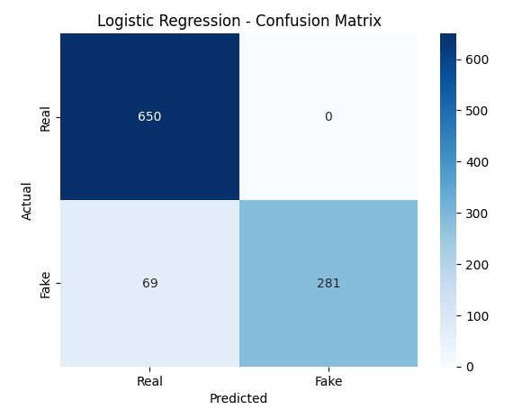
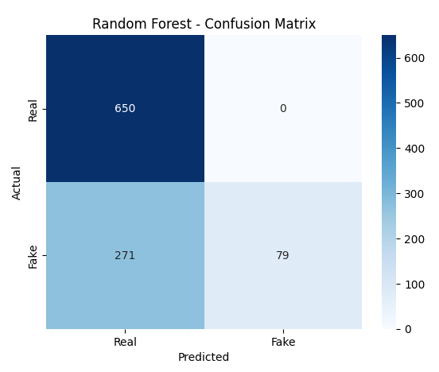
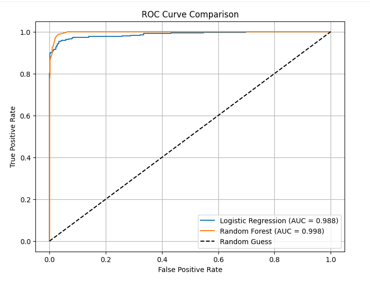
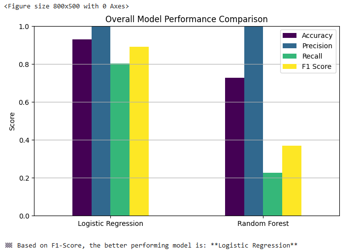

# 🧠 Fake Job Posting Detection using NLP and Machine Learning

## 📌 Overview
The rise of online job portals has brought convenience to job seekers, but it has also created opportunities for fraudsters to exploit unsuspecting applicants. Fake job postings, often designed to steal personal information or solicit money, have become a growing concern in today’s digital employment landscape.

This project focuses on building an automated system that can detect fraudulent job advertisements using Natural Language Processing (NLP) and Machine Learning (ML). By analyzing textual features of job postings, the system aims to classify them as either real or fake, thereby helping users identify potentially suspicious listings before engaging with them.

The project compares two models — **Logistic Regression** and **Random Forest** — to determine which performs better in identifying suspicious job postings.  

The final solution is deployed using **Streamlit**, allowing users to paste or upload job descriptions and instantly check whether they appear *real* or *fake*.
 
🔗 Live Demo: Fake Job Posting Detector : https://fake-job-detector-ncnyxwvhhuospq9sjkbvrp.streamlit.app

---

## 📂 Dataset Source
The dataset used is derived from the **Employment Scam Aegean Dataset (EMSCAD)**, a popular benchmark for job fraud detection tasks.  
Additionally, a **synthetic labeled dataset (1,000 samples)** was created to evaluate and visualize model performance more effectively.

### Dataset Summary
| Property | Description |
|-----------|--------------|
| Training samples | ~18,000 |
| Test samples | 1,000 |
| Features | `title`, `company_profile`, `description`, `requirements`, `benefits` |
| Target variable | `fraudulent` → 0 = Real, 1 = Fake |

## ⚙️ Data Preprocessing

Before feeding the text data into machine learning models, several preprocessing steps were applied to ensure data quality and consistency:

### 1. Data Cleaning
- Removed missing entries and duplicates.  
- Dropped irrelevant columns to focus on textual features.

### 2. Text Consolidation
- Combined multiple text columns (`title`, `description`, `requirements`, etc.) into a single `text` feature to capture the full context of the job posting.

### 3. Text Normalization
- Converted all text to lowercase.  
- Removed punctuation, special characters, and excessive whitespace.

### 4. Vectorization
- Transformed textual data into numerical representations using **TF-IDF Vectorization**, which reflects the importance of words in the context of all documents.

---

## ⚙️ Methods

The overall process is based on text classification using two pipelines — **Logistic Regression** and **Random Forest** — built with **scikit-learn**.

### 🧩 Workflow
Raw Data → Cleaning → TF-IDF Vectorization → ML Model (LR / RF) → Evaluation
### Model Details
| Step | Description |
|------|--------------|
| **Feature Engineering** | TF-IDF to represent text numerically |
| **Model 1** | Logistic Regression (interpretable and fast) |
| **Model 2** | Random Forest (handles feature interactions) |
| **Evaluation Metrics** | Accuracy, Precision, Recall, F1-Score, Confusion Matrix |
| **Visualization Tools** | Matplotlib and Seaborn |

### Why These Models?
- **Logistic Regression** offers strong performance on sparse TF-IDF data and is easy to interpret.  
- **Random Forest** captures non-linear patterns and works well when features interact in complex ways.  

Alternative algorithms such as SVMs or XGBoost were considered but not included to keep the focus on interpretability and efficiency.

---
## 📊 Model Evaluation

Models are evaluated using standard metrics:  

- **Accuracy:** Overall correctness.  
- **Precision:** Fraction of predicted fakes that are actually fake.  
- **Recall:** Fraction of actual fakes correctly identified.  
- **F1-Score:** Harmonic mean of precision and recall.  
- **Confusion Matrix:** Visual summary of true/false positives and negatives.  

Visualizations are done using **Matplotlib** and **Seaborn** to analyze model performance.

---
## 🚀 Deployment

The trained models are deployed via **Streamlit**, allowing real-time predictions.  

**Features:**
- Paste or upload job descriptions.
- Get instant predictions: **Real** or **Fake**.
- Highlight suspicious keywords (Logistic Regression).

### How to Run Locally

1. Clone the repository
```bash
git clone https://github.com/yourusername/fake-job-detector.git
cd fake-job-detector
```
2. Install dependencies
```bash
   pip install -r requirements.txt
   ```
3. Run the Streamlit app
```bash
streamlit run app.py
```
## 📈 Experiments & Results

We evaluated the performance of **Logistic Regression** and **Random Forest** models on the test dataset using standard classification metrics: Accuracy, Precision, Recall, and F1 Score.  

| Model                | Accuracy | Precision | Recall    | F1 Score  |
|----------------------|----------|-----------|-----------|-----------|
| Logistic Regression  | 0.931    | 1.0       | 0.802857  | 0.890650  |
| Random Forest        | 0.729    | 1.0       | 0.225714  | 0.368298  |


### 🔹 Confusion Matrices

**Logistic Regression Confusion Matrix**  
  

**Random Forest Confusion Matrix**  
  

---

### 🔹 ROC Curve Comparison

The ROC curve shows the trade-off between True Positive Rate and False Positive Rate for both models. Logistic Regression has a better area under the curve (AUC), indicating superior overall performance.  

  

---

### 🔹 Overall Performance Visualization

To summarize model performance across metrics:

  


### 🔹 Observations
- **Logistic Regression** outperformed Random Forest in overall metrics, especially in Recall and F1 Score.  
- **Random Forest** had perfect precision but very low recall, indicating it rarely misclassifies fake jobs as real, but misses many actual fakes.  
- Logistic Regression is more suitable for **imbalanced text classification** tasks like this one.  

## 🏁 Conclusion

This project demonstrates the effectiveness of **Natural Language Processing** and **Machine Learning** in detecting fraudulent job postings. Key takeaways include:

- **Logistic Regression** outperforms Random Forest on this dataset, achieving a strong balance between **Precision** and **Recall**, making it reliable for real-world detection.  
- **Random Forest** has perfect Precision but very low Recall, which may miss many fake postings, highlighting the importance of model selection based on use-case priorities.  
- **TF-IDF vectorization** is highly effective for text-based classification tasks, providing a computationally efficient way to represent textual features.  
- Deploying the model via **Streamlit** allows non-technical users to easily detect suspicious job postings in real time.  
- Future work could explore **deep learning approaches** (e.g., LSTM, BERT) or additional metadata (company ratings, links, posting source) to further improve detection accuracy.

Overall, this project shows that **machine learning models can significantly aid in identifying fraudulent job postings**, providing a practical tool for job seekers and platforms alike.

---

## 📚 References

1. Employed Scam Aegean Dataset (EMSCAD) – [Kaggle Dataset](https://www.kaggle.com/datasets/shivamb/real-or-fake-fake-job-postings)  
2. Scikit-learn documentation – [https://scikit-learn.org/stable/](https://scikit-learn.org/stable/)  
3. Streamlit documentation – [https://docs.streamlit.io/](https://docs.streamlit.io/)  

---
## Author

**Ruchika Kale** – B.Tech 2022-26 
GitHub: [Ruchika28-alt](https://github.com/Ruchika28-alt)  
Email: ruchikakale275@gmail.com


